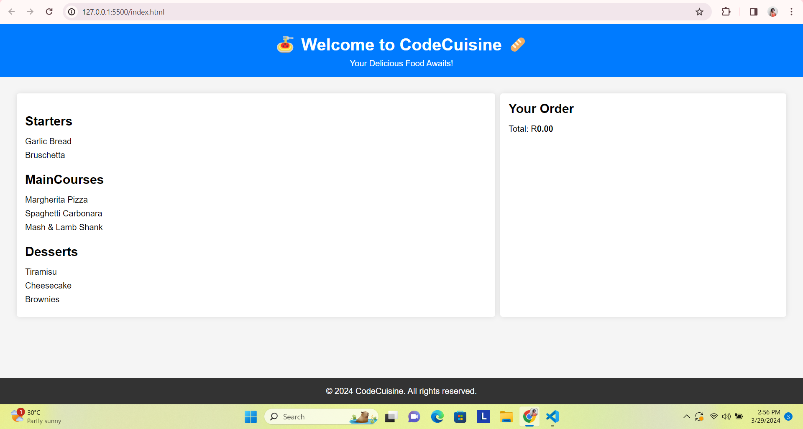

# [JSL06] CodeCuisine Menu Display System Challenge

## Overview

In this challenge, I built a simple menu display system for a fictional UberEats restaurant called "CodeCuisine" which displays different categories of food items and allows users to add items to their order with a click and is displayed along with the total order price. I applied various JavaScript concepts, including functions, closures, and event handling, to create an interactive menu.

## Reflections & Code choice:

1. Menu Data Structure: The `menu` is an object containing sample menu data, including categories(Starters, MainCourses, Desserts) and items.
2. Displaying Menu Items: The `displayMenuItems()` function dynamically generates HTML elements to display the menu items. It iterates over each category in the `menu` object and creates header elements for categories (`<h3>`) and list items (`<li>`) for menu items under each category.
3. Adding Items to the Order: When a user clicks on a menu item, the `addToOrder()` function is triggered. It dynamically adds the selected item to the order list and updates the total order price based on a fixed item price.
4. Initializing the Menu System: The `initMenuSystem()` function serves as the entry point of the menu system. It calls `displayMenuItems()` to populate the menu on the webpage.
5. Comments were already provided to explain the purpose of functions, variables, and code blocks as step by step instructions.

